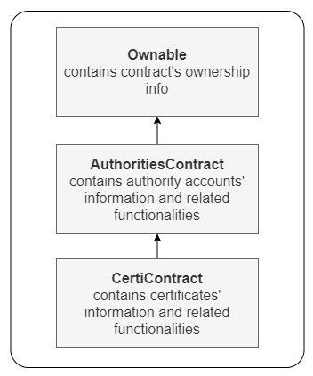

# CertiBlocks
A blockchain based certification add-on for educational platforms

### Website
* **Dashboard** - to see issued certificates
* **Certify** - to certify students
* **Verify certificate** - to verify a certificate with ID
* **Register new authority** - to register new accounts as authorities

### Smart Contract architecture

(Arrows indicate inheritance)

### Tools and Technologies used
* **Ethereum Smart Contract** - For secure back-end logic on blockchain
* **Truffle** - Project developed using Truffle framework
* **Ganache** - Local Blockchain for testing
* **Metamask** - Wallet for accounts
* **Firebase** - Website hosted on Google's Firebase
* **ReactJS** - Website made using ReactJS
* **web3.js** - For communicating with smart contract on the back-end
